# Лабораторная работа №1: Основы HTTP

## Цель выполнения лабораторной работы.

Основной целью выполнения лабораторной работы является изучение основных принципов протокола HTTP, понимание принципа составления запросов, отправляемые и получаемые заголовки.

## Анализ HTTP-запросов

Выполняю лабораторную работу пошагово, в соответствии с заданными условиями.

1.  Зайти на сайт [http://sandbox.usm.md/login](http://sandbox.usm.md/login).

    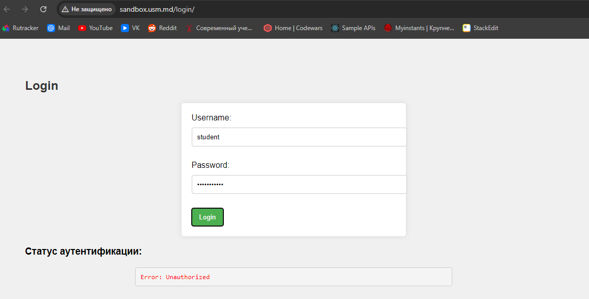

2.  Откройте вкладку `Network` в инструментах разработчика браузера.

    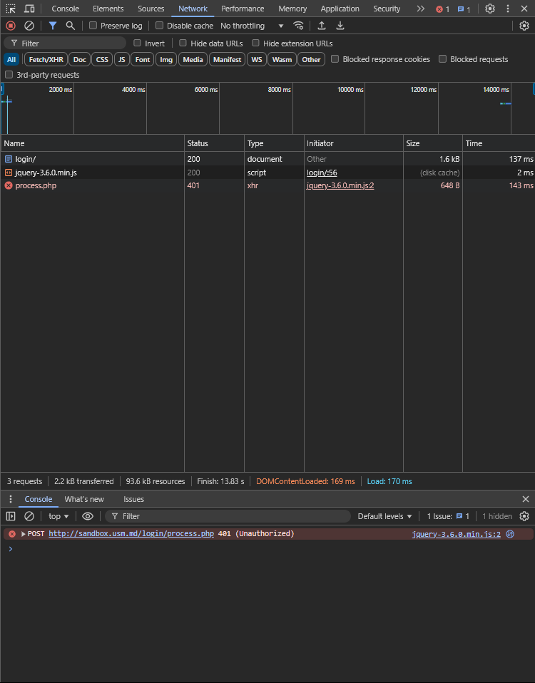

3.  Ввожу неверные данные для аутентификации.

    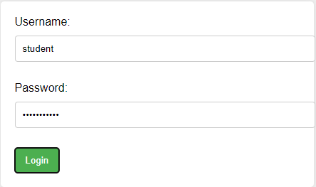

4.  Анализ запросов на сервер.
    Получив доступ ко вкладке Network и открыв сам запрос, делаем вывод, что был произведён запрос с методом POST.

    

5.  Детальный анализ запроса и ответа.

- Какой метод HTTP был использован для отправки запроса?

  - Для отправки запроса был использован метод POST

    

- Какие заголовки были отправлены в запросе?

  - Исходя из информации, сервер получил с запросом следующие заголовки:

    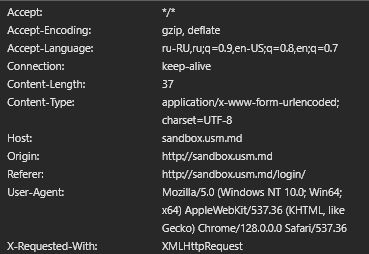

- Какие параметры были отправлены в запросе?

  - Были отправлены параметры запроса, которые пользователь ввёл:

    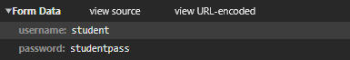

- Какой код состояния был возвращен сервером?

  - Был отправлен код 401: Не авторизован.

    

- Какие заголовки были отправлены в ответе?

  - Исходя из информации в Network, сервер отправил пять заголовков:

    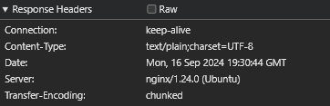

Теперь я повторяю шаги, однако использую правильные данные логина и пароля.

3. Ввожу верные данные для аутентификации.

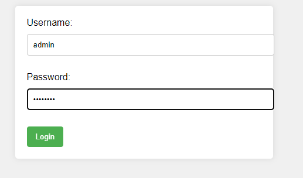

4. Анализ запросов на сервер.

   - Получив доступ ко вкладке Network и открыв сам запрос, делаем вывод, что был произведён запрос с методом POST.

   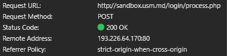

5. Детальный анализ запроса и ответа.

- Какой метод HTTP был использован для отправки запроса?

  - Для отправки запроса был использован метод POST

    

- Какие заголовки были отправлены в запросе?

  - Исходя из информации, сервер получил с запросом следующие заголовки:

    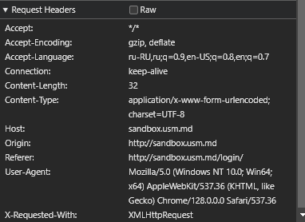

- Какие параметры были отправлены в запросе?

  - Были отправлены параметры запроса, которые пользователь ввёл

    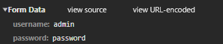

- Какой код состояния был возвращен сервером?

  - Был отправлен код 200: Ок, что значит, что запрос прошёл без ошибок.

    

- Какие заголовки были отправлены в ответе?

  - Исходя из информации в Network, сервер отправил пять заголовков:

    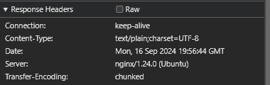

## Составление HTTP-запросов.

2.1
GET / HTTP/1.1
HOST: http://sandbox.com
User-Agent: Turturica Ilia

2.2
POST /cars HTTP/1.1
HOST: http://sandbox.com
Content-Type: application/json

{
"make" : "Toyota",
"model" : "Corolla",
"year": "2020"
}

2.3
PUT /cars HTTP/1.1
HOST: http://sandbox.com/cars/1
User-Agent: Turturica Ilia
Content-Type: application/json

{
"make" : "Toyota",
"model" : "Corolla",
"year": "2021"
}

2.4
POST /cars HTTP/1.1
Host: sandbox.com
Content-Type: application/json
User-Agent: John Doe
model=Corolla&make=Toyota&year=2020

Код 200 сработает в случае, если бы был произведён запрос с методом GET, который прошёл успешно.

Код 201 сработает в случае, если бы был произведен запрос с методом POST с корректно предоставленными в body данными в корректном формате (в данном случае, данные представлены в URL, а было необходимо представить в JSON).

Код 400 срабатывает в нашем случае, поскольку в заголовке пользователь утверждает, что передаёт данные в формате JSON, но в body данные переданы в формате URL.

Код 401 сработает в случае, если пользователь не осуществил аутентификацию или аутентификация была провалена, сервер отказывается выполнять запрос.

Код 403 сработает в случае, если у пользователя, осуществляющего запрос, не было бы прав на его исполнениею

Код 404 сработает в случае неправильного адреса.

Код 500 сработает в случае непредвиденного сбоя на сервере( переполнение памяти, внутренний сбой и т.д)

## Дополнительное задание. HTTP_Quest

Работаю в приложении Postman, предоставляющая удобный интерфейс.

Первым шагом выполняю отправку запроса с методом пост на нужный URL с моим именем и фамилией в качестве заголовка.

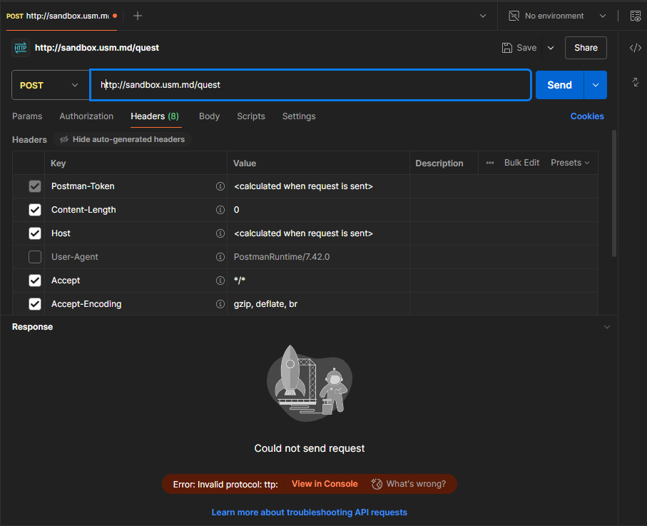

Успешно выполненный запрос предоставил следующий ответ от сервера:

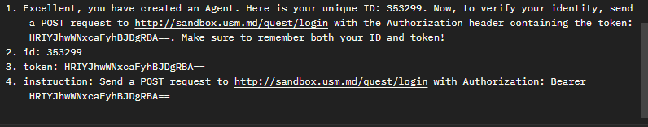

Следующим шагом вновь выполняю запрос с методом POSt на нужный URL, в заголовках указывая полученный токен под именем Authorization и вновь получаю ответ после успешного запроса на серверю

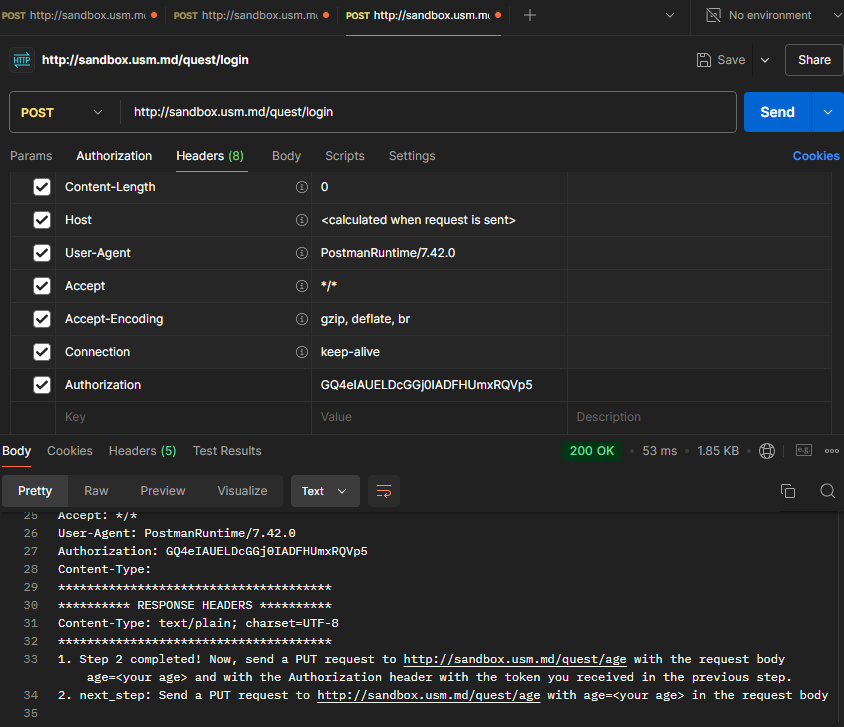

Далее, я произвожу PUT запрос с телом запроса моего возраста.

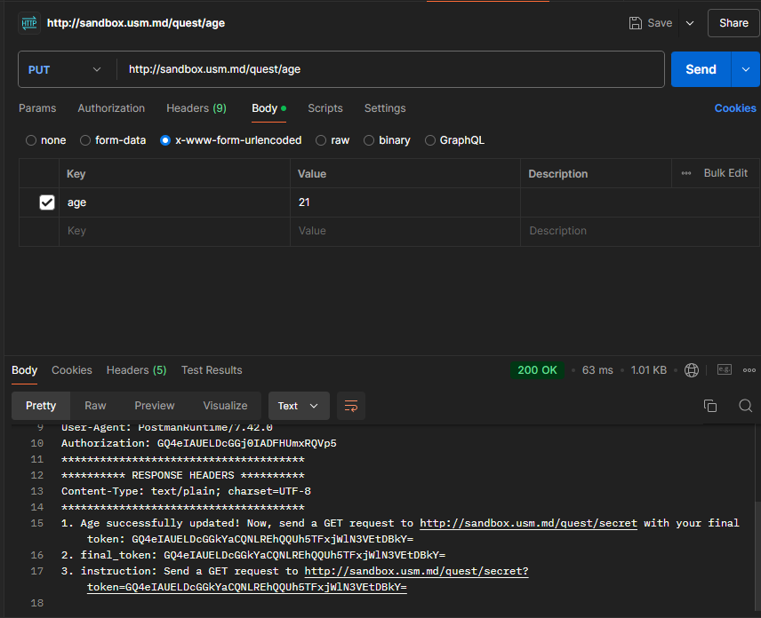

Последним я произвожу GET запрос и получаю финальный секрет

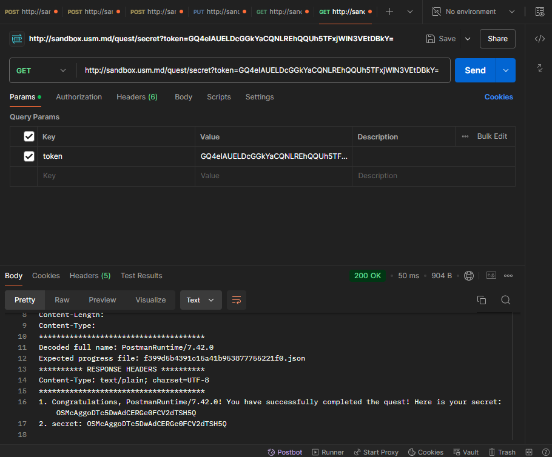

Выполнив все шаги по квесту, я получил следующий секрет: OSMcAggoDTc5DwAdCERGe0FCV2dTSH5Q

## Использованные источники

Коды состояний: [https://ru.wikipedia.org/wiki/%D0%A1%D0%BF%D0%B8%D1%81%D0%BE%D0%BA_%D0%BA%D0%BE%D0%B4%D0%BE%D0%B2_%D1%81%D0%BE%D1%81%D1%82%D0%BE%D1%8F%D0%BD%D0%B8%D1%8F_HTTP]
