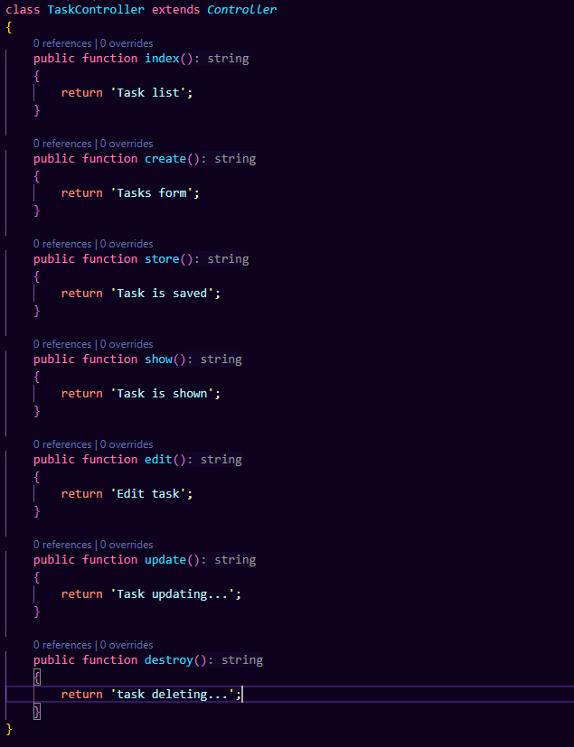
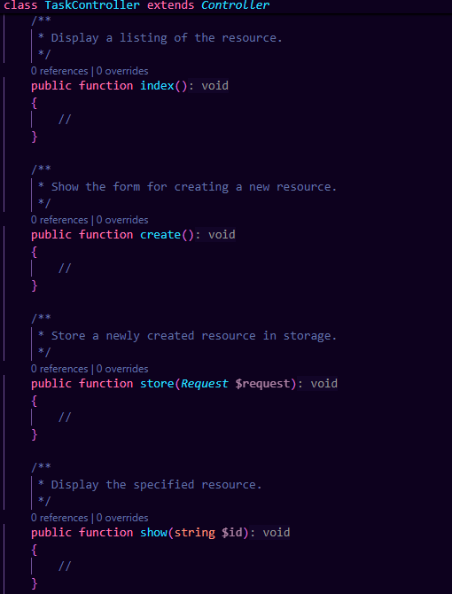

# Лабораторная работа №2: HTTP-запросы и шаблонизация в Laravel

## Цель работы:

Изучить основные принципы работы с HTTP-запросами в Laravel и шаблонизацию с использованием Blade на основе веб-приложения To-Do App для команд — приложения для управления задачами внутри команды.

Приложение предназначено для команды, которая хочет управлять своими задачами, назначать их участникам, отслеживать статус и приоритет задач (похоже на Github Issues).

## №1 Подготовка к работе, установка Laravel

1. При помощи команды composer **create-project laravel/laravel:^10** todo-app создаю стандартный проект, включающий в себя всё необходимое:


2. Перехожу в директорию проекта при помощи команды **cd todo-app**


3. Далее, я запускаю сервер при помощи команды **php artisan serve** и открываю страницу http://localhost:8000


Открыв страницу, я обнаруживаю домашнюю страницу laravel, которая предоставляет полный доступ к изучению её экосистемы.


## №2 Настройка окружения

1. Открываю файл .env и указываю следующие настройки:


2. Генерирую ключ приложения для шифрования данных:


В случае, если злоумышленник получит доступ к данному ключу, он сможет получить доступ к зашифрованным данных и некоторым частям приложения.

## №3. Основы работы с HTTP-запросами

### №3.1. Создание маршрутов для главной страницы и страницы "О нас"

1. Создаю при помощи команды класс-контроллер HomeController:


2.  Создаю метод index в HomeController:


3.  Создаю маршрут для главной страницы в файле routes/web.php


И убеждаюсь, что открывается пустая страница:


## №3 Создание маршрутов для задач

1. При помощи команды создаю контроллер TaskController:


Следующим шагом, я создаю в классе методы, которые, в последствии, будут использоваться для формирования функционала:



В последствии, я использую метод создания ресурсного контроллера, который создаёт контроллер с предписанными методами для более быстрой разработки. Мой необходимый набор методов совпадает с тем, что даёт ресурсный контроллер, потому использую его:




2. Создаю маршруты для методов контроллера TaskController в файле routes/web.php и указываю правильные HTTP-методы для каждого маршрута:

3. Использую группирование маршрутов для контроллера TaskController с префиксом /tasks, чтобы упростить маршрутизацию и улучшить читаемость кода:

4. Определяю правильные имена маршрутов для методов контроллера TaskController:

5. Добавляю валидацию параметров маршрута id для задач.


6. Вместо ручного создания маршрутов для каждого метода использую ресурсный контроллер:


7. Проверяю созданные маршруты:

-   При ручном создании маршрутов разработчик вручную создаёт и указывает имена для каждого маршрута, в то время как автоматическое создание будет создавать стандартный набор путей со стандартными названиями, которые будут соответствовать операциям(create, show и т.д)


## №4. Шаблонизация с использованием Blade

### №4.1. Создание макета страницы

Создаю основной макет страницы, который будет использоваться, как шаблон. Для определения различных областей, использую @yield


### №4.2. Использование шаблонов Blade

1. home.blade.php - домашняя страница, на которой используется шаблон app.blade.php, сделанный в №4.1.

2. Добавлен контент в виде:

    - Приветственное сообщение
    - Навигация
    - Информация о приложении


3. Создаю представление "О нас" — about.blade.php с использованием макета layouts/app.blade.php в каталоге resources/views.


4. Создаю представления для задач со следующими шаблонами в каталоге:


5. Рендерю статические данные, переданные в контроллере при помощи директивы @foreach.


### №4.3 Анонимные компоненты Blade

1. Создаю при помощи следующей команды анонимный компонент header, который, в последствии, использую в шаблоне

```
php artisan make:component Header --view
```

2. При помощи той же команды создаю анонимный компонент task для обработки данных о задаче. В компоненте отображаются:

-   Название задачи;
-   Описание задачи;
-   Дата создания задачи;
-   Дата обновления задачи;
-   Действия над задачей (редактирование, удаление);
-   Статус задачи (выполнена/не выполнена);
-   Приоритет задачи (низкий/средний/высокий);
-   Исполнитель задачи (Assignment), то есть имя пользователя, которому назначена задача.

3. Отображаю созданный компонент задачи на странице show.blade.php


### №4.4 Стилизация страниц.

Для стилизации страниц был использован Tailwind CSS и одна библиотека typedJS, для эффекта печатания текста на домашней странице

### №5 Дополнительные задания

1. Используя View Composer, отображаю на домашней странице последнюю созданную задачу:

```
  View::composer('home.index', function ($view) {
            $tasks = [
                [
                    'id' => 1,
                    'title' => 'Complete Documentation',
                    'description' => 'Finish writing the documentation for the project.',
                    'created_at' => '2024-10-01 10:00:00',
                    'updated_at' => '2024-10-02 12:00:00',
                    'priority' => 'High',
                    'status' => true,
                    'assignee' => 'John Doe',
                ],
                [
                    'id' => 2,
                    'title' => 'Fix Bugs',
                    'description' => 'Identify and resolve bugs reported by the QA team.',
                    'created_at' => '2024-10-03 09:00:00',
                    'updated_at' => '2024-10-04 14:00:00',
                    'priority' => 'Medium',
                    'status' => false,
                    'assignee' => 'Jane Smith',
                ],
                [
                    'id' => 3,
                    'title' => 'Implement Feature X',
                    'description' => 'Develop and integrate Feature X into the current system.',
                    'created_at' => '2024-10-05 08:30:00',
                    'updated_at' => '2024-10-06 11:00:00',
                    'priority' => 'Low',
                    'status' => true,
                    'assignee' => 'Alex Johnson',
                ]
            ];

            $lastTask = end($tasks);
            $view->with('lastTask', $lastTask);
        });
```

Результат:


2. Создаю анонимный компонент для приоритетности задачи

```
@props(['priority'])

@if ($priority === 'High')
    <span class="flex gap-2 text-red-900"><svg xmlns="http://www.w3.org/2000/svg" fill="none" viewBox="0 0 24 24"
            stroke-width="1.5" stroke="currentColor" class="size-6">
            <path stroke-linecap="round" stroke-linejoin="round"
                d="M12 9v3.75m9-.75a9 9 0 1 1-18 0 9 9 0 0 1 18 0Zm-9 3.75h.008v.008H12v-.008Z" />
        </svg>
        High</span>
@elseif ($priority === 'Medium')
    <span class="flex gap-2 text-orange
                                        -900"><svg xmlns="http://www.w3.org/2000/svg" fill="none" viewBox="0 0 24 24"
            stroke-width="1.5" stroke="currentColor" class="size-6">
            <path stroke-linecap="round" stroke-linejoin="round"
                d="M12 9v3.75m0-10.036A11.959 11.959 0 0 1 3.598 6 11.99 11.99 0 0 0 3 9.75c0 5.592 3.824 10.29 9 11.622 5.176-1.332 9-6.03 9-11.622 0-1.31-.21-2.57-.598-3.75h-.152c-3.196 0-6.1-1.25-8.25-3.286Zm0 13.036h.008v.008H12v-.008Z" />
        </svg>
        Medium</span>
@elseif ($priority === 'Low')
    <span class="flex gap-2 text-green-700">
        <svg xmlns="http://www.w3.org/2000/svg" fill="none" viewBox="0 0 24 24" stroke-width="1.5" stroke="currentColor"
            class="size-6">
            <path stroke-linecap="round" stroke-linejoin="round"
                d="M6.633 10.25c.806 0 1.533-.446 2.031-1.08a9.041 9.041 0 0 1 2.861-2.4c.723-.384 1.35-.956 1.653-1.715a4.498 4.498 0 0 0 .322-1.672V2.75a.75.75 0 0 1 .75-.75 2.25 2.25 0 0 1 2.25 2.25c0 1.152-.26 2.243-.723 3.218-.266.558.107 1.282.725 1.282m0 0h3.126c1.026 0 1.945.694 2.054 1.715.045.422.068.85.068 1.285a11.95 11.95 0 0 1-2.649 7.521c-.388.482-.987.729-1.605.729H13.48c-.483 0-.964-.078-1.423-.23l-3.114-1.04a4.501 4.501 0 0 0-1.423-.23H5.904m10.598-9.75H14.25M5.904 18.5c.083.205.173.405.27.602.197.4-.078.898-.523.898h-.908c-.889 0-1.713-.518-1.972-1.368a12 12 0 0 1-.521-3.507c0-1.553.295-3.036.831-4.398C3.387 9.953 4.167 9.5 5 9.5h1.053c.472 0 .745.556.5.96a8.958 8.958 0 0 0-1.302 4.665c0 1.194.232 2.333.654 3.375Z" />
        </svg>
        Low</span>
@endif
```

Результат:


## Контрольные вопросы

1. Что такое ресурсный контроллер в Laravel и какие маршруты он создаёт?

Ресурсный контроллер является универсальным инструментом в Laravel, который позволяет создать функции для стандартных методов, которые используются для полноценного функционирования сайта. Из них:

-   index - главная страница
-   create - страница для создания
-   show - показать какой-то элемет
-   edit - форма для изменения элемента
-   update - подтверждение изменения элемента
-   delete - удаление элемента

2. Объяснить разницу между ручным созданием маршрутов и использованием ресурсного контроллера.

Ручное создание маршрута требует наименования и правильного взаимодействия с функциями, созданными в контроллере. Разработчик имеет полный контроль над именованием маршрутов, созданием различных префиксов и прочего, в тот момент, как ресурсный контроллер самостоятельно пропишет маршруты, с единственной возможностью изменения имени маршрутов.

3. Преимущества использования анонимных компонентов Blade.

-   Чистый проект. Анонимные компоненты позволяют создать компонент без требуемого на логику класса, что позволяет сделать проект более легковесным
-   Возможность переиспользования. Компонент легко использовать в разных частях проекта, не дублируя код
-   Чистота кода и инкапсуляция. Позволяет изолировать нужную логику представления компонента, что улучшает читаемость кода

4. Методы HTTP-запросов, используемые для выполнения операций CRUD
   CRUD является аббривиатурой от:

-   CREATE - создание элемента. Используется метод POST
-   READ - чтение элемента. Метод GET
-   Update - обновление элемента. Методы PUT и PATCH.
-   DELETE - удаление. Метод DELETE
