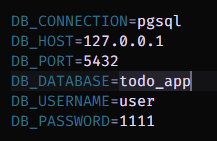
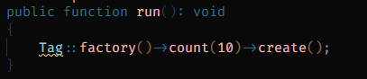
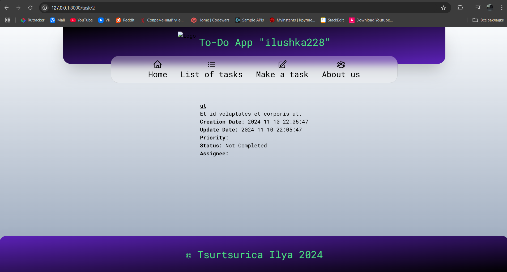

# Лабораторная работа №3: HTTP-запросы и шаблонизация в Laravel

## Цель работы:

Познакомиться с основными принципами работы с базами данных в Laravel. Научиться создавать миграции, модели и сиды на основе веб-приложения To-Do App.
Приложение предназначено для команды, которая хочет управлять своими задачами, назначать их участникам, отслеживать статус и приоритет задач (похоже на Github Issues).

## №1 Подготовка к работе.

1. Было установлено СУБД PostgreSQL, в котором далее будет вестись работа

2. Была создана база данных todo_app (при помощи Docker).

3. В файле окружения были изменены под нужные переменные окружения.



## №2 Создание моделей и миграции

1. При помощи команды:

```php
php artisan make:model Category -m
```

Была создана модель категории в миграции.

2. Далее указываются необходимые поля в самой миграции для модели Category.
   

3. При помощи команды:

```php
php artisan make:model Task -m
```

Была создана модель задач в миграции.

4. Далее указываются необходимые поля в самой миграции для модели Task.


5. Была запущена миграция для создания таблиц в базе данных при помощи команды:

```php
php artisan migrate
```

При помощи DBeaver я убеждаюсь в том, что таблицы были созданы:


6. При помощи команды:

```php
php artisan make:model Tag -m
```

Была создана модель тегов в миграции.

7. Далее указываю необходимые поля:


8. Поле $fillable позволяет указывать поля, которые можно заполнять. По примеру ниже, в каждую созданную модель я вписываю $fillable для того, чтобы контролировать поток вводных данных.


## №3 Связь между таблицами

1. При помощи команды:

```php
php artisan make:migration add_category_id_to_tasks_table --table=tasks
```

Создаю миграцию для добавления поля category_id в таблицу task.
Далее определяю структуру поля category_id и добавляю внешний ключ для связи с таблицей category


2. При помощи команды:

```php
php artisan make:migration create_task_tag_table
```

Создаю промежуточную таблицу для связи многие ко многим между задачами и тегами.

3. Определяю структуру таблицы в миграции:


4. При помощи команды:

```php
php artisan migrate:refresh
```

Заново применяю все миграции.

## №4 Связи между моделями

1. Добавьте отношения в модель Category (Категория может иметь много задач)


2. Добавляю отношения в модель Task

-   Задача может иметь много тегов.
-   Задача прикреплена к одной категории.


3. Добавляю отношения в модель Tag (Тег может быть прикреплен к многим задачам)


4. Добавил соответствующие поля в $fillable моделей.

## №5. Создание фабрик и сидов.

1. При помощи команды:

```php
php artisan make:factory CategoryFactory --model=Category
```

И определяю структуру:


2-3. Создаю фабрику для моделей Tag и Task:


4.  При помощи команды:

```php
php artisan make:seeder 'title'
```

Буду создавать сидеры для Tag, Task и Category. Для каждого пишу команду, которая позволит создать определённое количество информации:



5. Обновляю файл DatabaseSeeder для запуска сидов и запускаю их:


## №6. Работа с контроллерами и представлениями

1. В контроллер TaskController я подключаю модель Task для того, чтобы работать с данными из соответствующей таблицы, используя ORM.

2. Обновляю метод index для получения списка задач.

```php
use App\Models\Task;
...
$tasks = Task::all();
```

Данные были получены в приложении.


3. Обновляю метод show для получения определённой задачи из списка всех существующих.

```php
 $task = Task::findOrFail($id);
```

FindOrFail позволяет сразу же обработать ошибку в случае, если задача найдена не будет и перекинет пользователя на страницу с 404 ошибкой



Далее, я немного переработал модель Tag и Task, которые позволят мне находить все теги, привязанные к задаче.


Позволяет узнать, относится ли ко многим тегам задача через промежуточную модель task_tag.

4. Используя хелпер with, я использую Eager Loading(жадную загрузку), которая позволяет загружать задачу сразу же с тегами, что уменьшит нагрузку на БД.


5. Обновляю соответствующие представления для отображения списка задач и отдельной задачи.

6. Доделав форму для создания задачи, я далее дорабатываю метод store, который позволит добавлять в базу данных задачи:


На странице со всеми задачами наша созданная задача появилась:


7. Обновив метод update, который позволяет обновить данные в БД:


Теперь представляется возможным обновить задачу:


Итог:


8. Обновив метод destroy в TaskController'e


И добавив кнопку на странице редактирования задачи для удаления:


Теперь можно удалить задачу. При нажатии на кнопку задача удаляется:


## Контрольные вопросы

1. Что такое миграции и для чего они используются?

Миграции представляют собой инструмент, имитирующий возможность систем контроля версий управлять версиями базы данных и упрощает процесс её преобразования через непосредственно фреймворк Laravel.

2. Что такое фабрики и сиды, и как они упрощают процесс разработки и тестирования?

Фабрики представляют собой класс в Laravel, который позволяет задать структуру определённым данным.
Сиды представляют собой класс в Laravel, которые заполняют базу данных dummy data - фейковыми данными.
Процесс разработки и тестирования, благодаря этим инструментам, значительно упрощается. Мы можем имитировать работу веб-приложения со всеми аспектами (размещение данных и т.д)

3. Что такое ORM? В чем различия между паттернами DataMapper и ActiveRecord?

ORM является паттерном проектирования, который позволяет работать с базой данных, используя объекты, а не SQL-запросы. ORM помогает абстрагировать работу с базой данных, позволяя работать с данными как с объектами, а не как с таблицами и строками.

ActiveRecord: каждый объект модели (например, Task) инкапсулирует логику не только для представления данных, но и для их хранения в базе данных. Другими словами, объекты модели могут выполнять операции сохранения, обновления, удаления данных в базе данных.

DataMapper объект модели не содержит логики для работы с базой данных. Вместо этого существует отдельный слой (например, репозиторий или маппер), который занимается преобразованием данных из базы данных в объекты и наоборот. Таким образом, модель и база данных остаются разделёнными.

Различие состоит в разделении логики.

4. В чем преимущества использования ORM по сравнению с прямыми SQL-запросами?

-   Благодаря абстракции от БД, код получается более читаемым и простым.
-   ORM позволяет не писать сложные SQL-запросы для создания, чтения, обновления и удаления данных. Вместо этого можно использовать методы моделей и классов, что сокращает количество кода и повышает его поддерживаемость.
-   ORM предоставляет удобные способы для работы с отношениями между сущностями (например, «один ко многим», «многие ко многим»). Это особенно полезно при работе с многими связанными таблицами.

5. Что такое транзакции и зачем они нужны при работе с базами данных?

Транзакция является последовательностью операций, которые выполняются как единое целое. Она начинается с выполнения первой операции и завершается, когда все операции успешно завершены. Если на любом этапе транзакции возникает ошибка, то транзакция откатывается, и все изменения, сделанные в рамках этой транзакции, отменяются.
Транзакции необходимы при работе с базами данных для обеспечения целостности данных, предотвращения ошибок при параллельной обработке, поддержания целостности при сбоях системы и упрощения обработки сложных операций.
