# Лабораторная работа №4: Формы и валидация данных

## Цель работы:

Познакомиться с основами создания и управления формами в Laravel.

Освоить механизмы валидации данных на сервере, использовать предустановленные и кастомные правила валидации, а также научиться обрабатывать ошибки и обеспечивать безопасность данных.

## №1 Подготовка к работе.

1. Работа продолжается в приложении, реализованном с 1 по 3-и лабораторные работы.

2. Переменные окружения были записаны для подключения с БД.

## №2. Создание формы

1. Была создана форма для создания новой задачи:

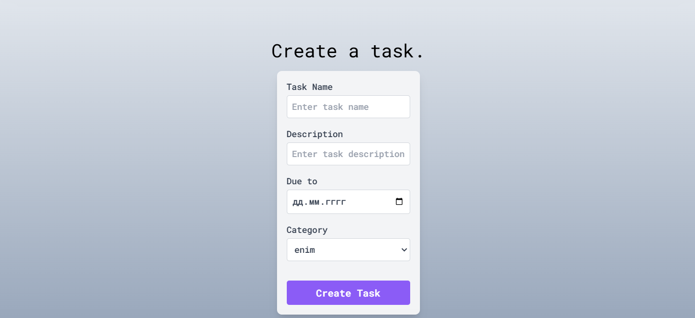

-   Форма содержит поля: Название, Описание, дата выполнения, Категория

-   Был использован Blade-шаблон

-   Поле "Категория" является выпадающим списком

-   Форма отправляет методом POST и сохраняет данные в БД.

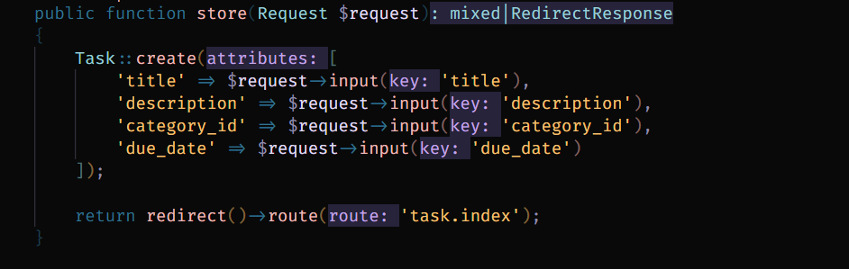

2. Был создан маршрут /tasks благодаря ресурсному контроллеру для попадания на страницу создания таблицы.

3. В TaskController были добавлены метод create (для отображения формы) и store (для сохранения данных в БД)

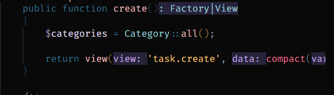

## №3. Валидация данных на стороне сервера

1. Была реализована валидация данных, получаемых с формы

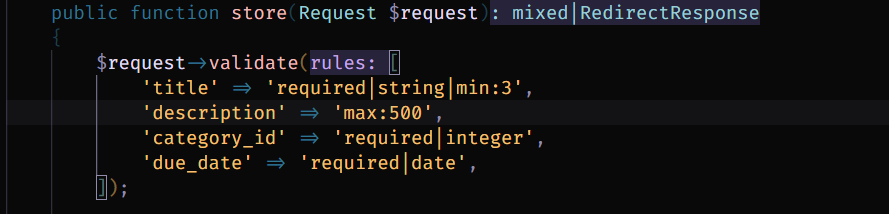

2. Требования к полям:

-   title — обязательное, строка, минимальная длина 3 символа.
-   description — строка, необязательно, максимальная длина 500 символов.
-   due_date — обязательное, дата, должна быть не меньше сегодняшней даты.
-   category_id — обязательное, должно существовать в таблице categories.

3. Ошибки были возвращены к форме посредством директивы @error. После валидации, в случае, если данные не подходят, код ниже validate не проходит и laravel возвращает пользователя обратно в форму с ошибками и добавляет их в сессию. Оттуда их можно вывести при помощи директивы.

4. Проверяю корректность работы валидации и убедитесь, что ошибки отображаются правильно.

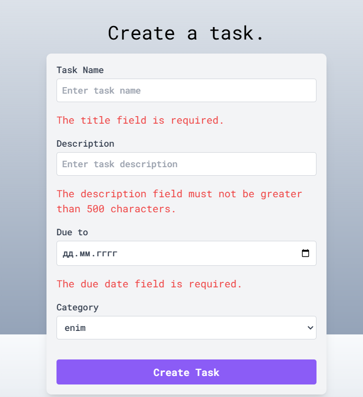

## №4. Создание собственного класса запроса (Request)

1. Был создан собственный класс запроса для валидации формы при помощи команды:

```php
php artisan make:request CreateTaskRequest
```

-   В классе были определены правила валидации:

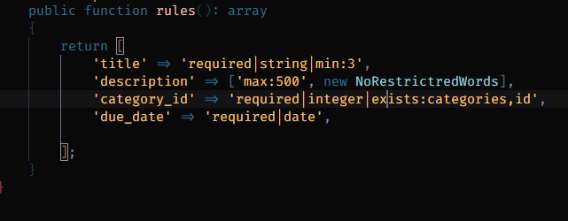

-   Добавлена проверка на существование категории

-   Была обновлена логика store метода. Теперь используется созданный request и, потому, логика валидации в методе не нужна:

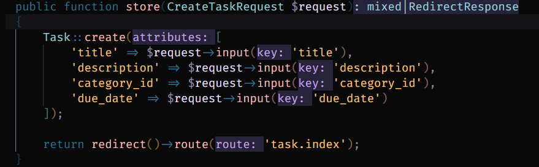

3. Убеждаемся в том, что сообщения об ошибке приходят к форме и правильно выводятся

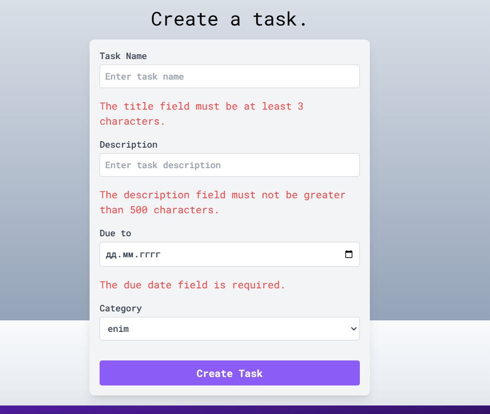

## №5. Добавление флеш-сообщений

1. Флеш-сообщения в Laravel используются временного хранения данных в сессии, которые будут доступны в течении одного запроса. Для сообщения используется переданные данные во флеш сообщения. Для этого вместе с redirect'ом я использовал with

```php
 return redirect()->route('task.index')->with('success', 'Task successfully made!');
```

2. Для отображения успешного добавления на странице со всеми задачами(куда пользователя кидает) я добавил всплывающее окно с соответствующим сообщением.

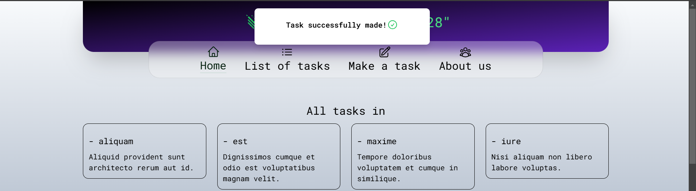

## №6. Защита от CSRF

1. Для каждой формы в приложении была добавлена директива @csrf для обеспечения безопасности с помощью токенов.

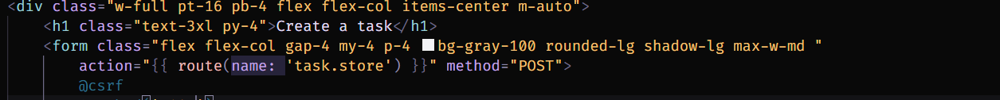

2. Для того, чтобы убедиться, что форма использует метод POST, воспользуемся методом request'a getMethod().

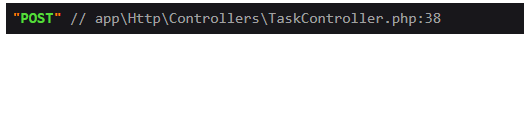

## №7. Обновление задачи

1. Была создана форма для обновления задачи:

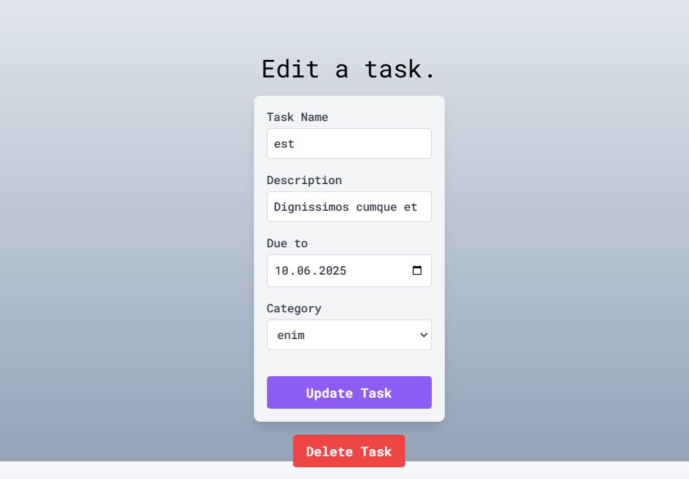

2. Был создан UpdateMethodRequest с аналогичными правилами валидации, что и для создания приложения.

```php
php artisan make:request UpdateTaskRequest
```

3. Был создан маршрут для перенаправления пользователя через кнопку Edit Task на странице задач на страницу с формой редактирования

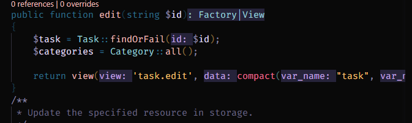

4.  Был создан маршрут для обпработки запроса и обновления данных в БД.

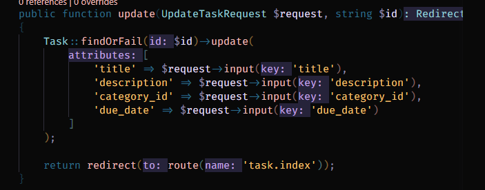

5. Метод Update в TaskController'e был обновлён и теперь позволяет обновить данные с предварительной валидацией:

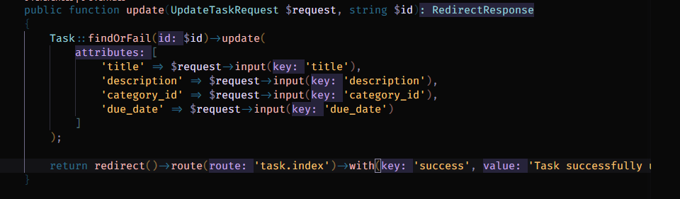

До:

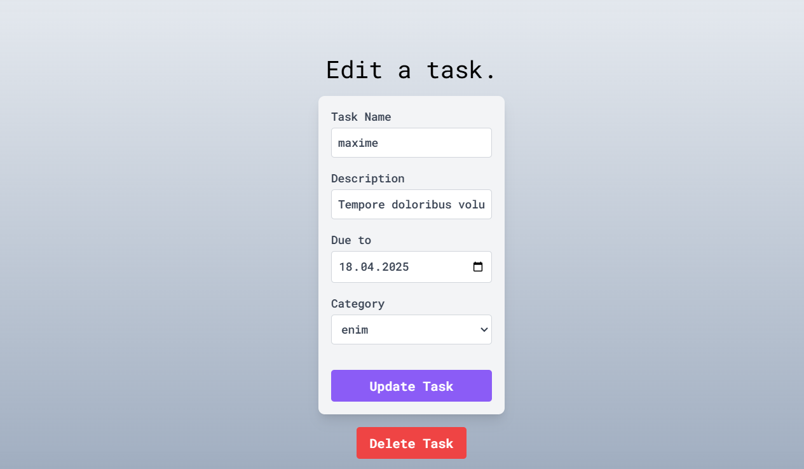

После:
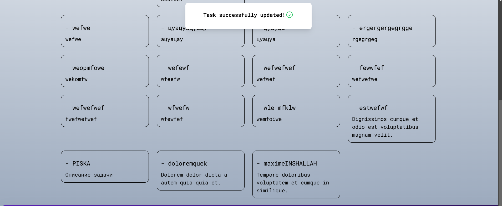

## Дополнительное задание

1. Создаётся правило, которое запрещает некоторые слова в поле description.

2. При помощи команды:

```php
php artisan make:rule NoRestrictredWords
```

Было создано кастомное правило в проекте:

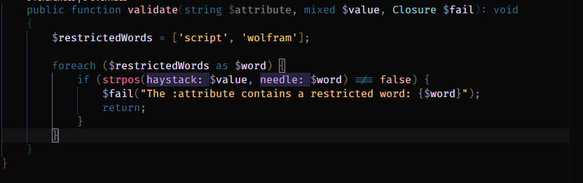

Процесс следующий:

-   Был задан массив запрещённых слов
-   Далее, с помощью foreach, пробегаем по массиву и смотрим, есть ли совпадения в данной строке
-   Если есть, записываем в $fail (показывает ошибку) где было нарушено правило и почему
-   Возвращаем из функции

3. Применяем правило в request'e CreateTaskRequest:

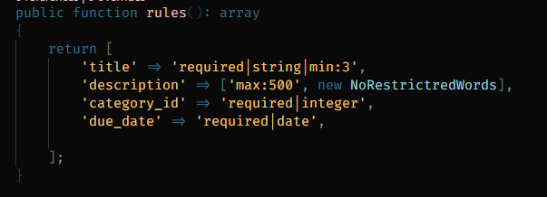

Результат:

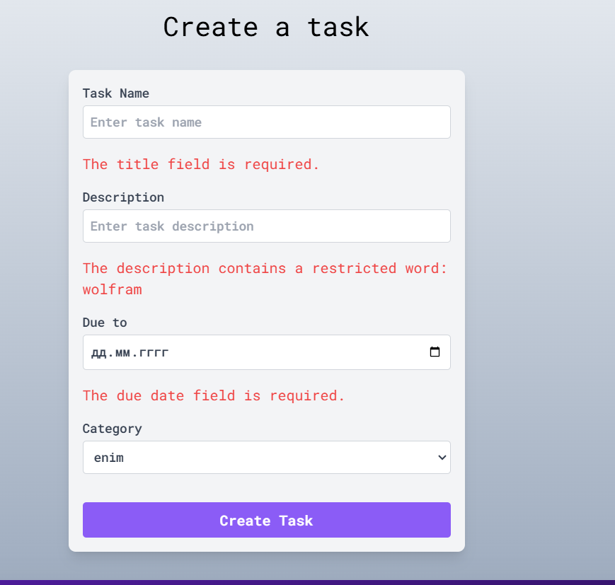

## Контрольные вопросы

1. Валидация данных является процессом сравнения данных с некоторым шаблоном, заданным ранее. Процесс отличается от фильтрации отсутствием изменения данных, т.е данные никак не преображаются.

2. Для этого в Laravel была создана директива @csrf, которая применяется в начале каждой формы. В Laravel предусмотрен механизм защиты, потому разработчику самостоятельно прописывать логику не нужно.

3. Для создания и использования собственных классов запросов (Request) в Laravel используется команда:

```php
php artisan make:request RequestName
```

В сгенерированном классе присутствует метод rules(), где можно прописать правила для валидации, а также authorize(), если требуется какая-то дополнительная авторизация от пользователя.

4. Для защиты от XSS-атак в Laravel предусмотрено автоматическое экранирование данных через две пары обратных скобок ({{}}).
   Также можно воспользоваться дополнительными валидацией и фильтрацией для более точного устранения возможных угроз.
