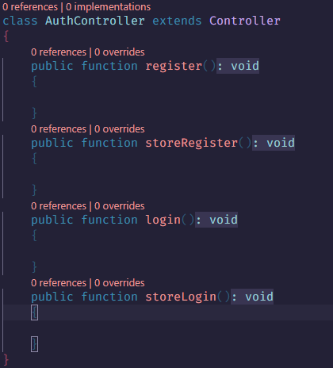
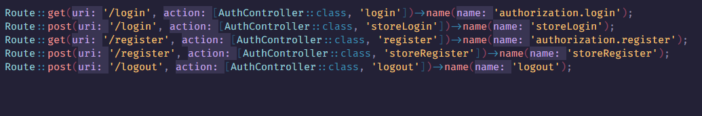
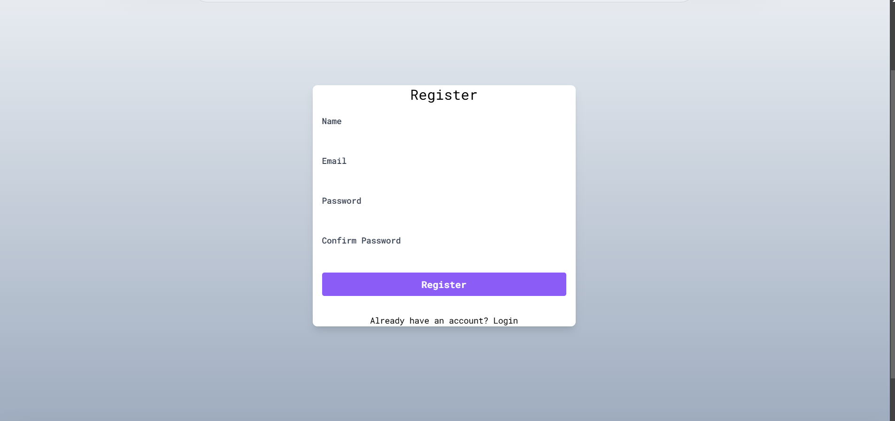
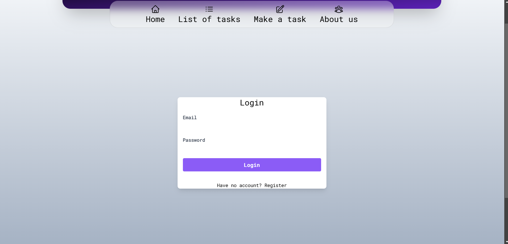
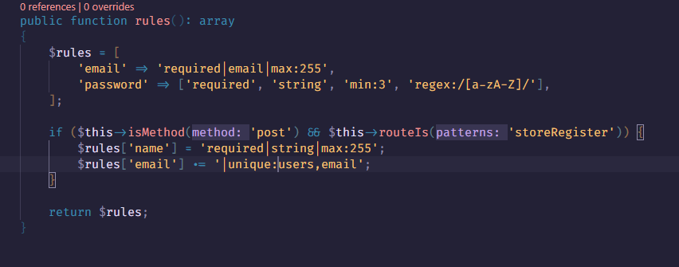

# Лабораторная работа №5. Компоненты безопасности в Laravel

## Цель работы:

Познакомиться с основами компонентов безопасности в Laravel, таких как аутентификация, авторизация, защита от CSRF, а также использование встроенных механизмов для управления доступом.

Освоить подходы к безопасной разработке, включая создание защищенных маршрутов и управление ролями пользователей.

## №1. Подготовка к работе

Работа продолжается в проекте, созданном в предыдущих лабораторных.

## №2. Аутентификация пользователей

1. При помощи команды:

```
php artisan make:controller AuthController
```

Был создан контроллер для управления аутентификацией пользователей.

2. Были созданы следующие методы для регистрации, входа и выхода пользователя:

-   register() для отображения формы регистрации.
-   storeRegister() для обработки данных формы регистрации.
-   login() для отображения формы входа.
-   storeLogin() для обработки данных формы входа.



3. Были созданы маршруты для регистрации, входа и выхода пользователя.



4. Были обновлены представления для форм регистрации и логина:





5. Был создан отдельный класс AuthRequest с правилами для валидации данных:



# Контрольные вопросы

1. Какие готовые решения для аутентификации предоставляет Laravel?

Laravel предоставляет множество готовых инструментов и решений для реализации аутентификации, от встроенных по умолчанию до дополнительных пакетов:

-   Breeze - легковесный и минималистичный стартовый комплект для аутентификации, включающий в себя базовые функции: регистрацию, вход, выход и сброс пароля.
-   Jetstream - более мощное решение для аутентификации и управления пользователями, включающее в себя регистрацию, вход, управление профилем, двухфакторную аутентификацию, сессии пользователя, e-mail верификацию.
-   Fortify — мощный инструмент для реализации аутентификации в Laravel, предоставляющий серверную логику для таких функций, как регистрация, вход, сброс пароля, двухфакторная аутентификация, управление профилем, проверка электронной почты, обновление пароля и управление сессиями.

2. Какие методы аутентификации пользователей вы знаете?

Из общеизвестных методов аутентификации можно выделить: аутентификацию по паролю, многофакторную аутентификацию (MFA (требуется либо pin, либо токен, биометрические данные и т.д)) и одноразовые пароли, приходящие либо на почту, либо на номер.

3. Чем отличается аутентификация от авторизации?

Аутентификация является процессом подтверждения личности пользователя и происходит первой. Авторизация же является процессом, определяющим, какие действия пользователь может выполнять и к каким ресурсам имеет доступ и происходит после успешной аутентификации.

4. Как обеспечить защиту от CSRF-атак в Laravel?

В Laravel встроена защита от CSRF-атак (Cross-Site Request Forgery), которая активируется по умолчанию. Она защищает приложения от выполнения нежелательных действий через поддельные запросы. Используется посредством прописывания токена @csrf.
